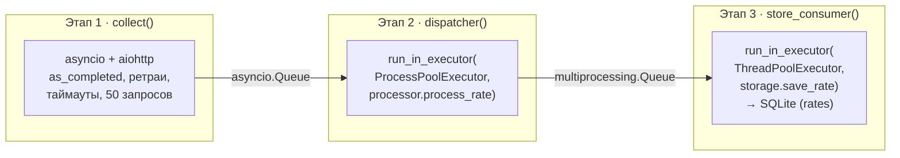

<div align="center">

# 💱 Currency Aggregator

### Гибридный конвейер: `asyncio` + `ProcessPoolExecutor` + `ThreadPoolExecutor`

Асинхронный сбор курсов валют, параллельная CPU-bound обработка через `numpy`
и безопасная запись в SQLite — три парадигмы конкурентности в одном конвейере.

[](https://www.python.org/)
[](https://docs.aiohttp.org/)
[](https://numpy.org/)
[](https://www.sqlite.org/)
[](report/report.md)
[](#)

</div>

---

## 📖 О проекте

**Currency Aggregator** — это демонстрационное приложение, в котором
**одновременно** работают три модели конкурентного программирования Python,
каждая решая свою задачу там, где она максимально эффективна:

| Парадигма | Зачем | Где в коде |
|---|---|---|
| 🔄 **asyncio + aiohttp** | Массовый I/O-bound сбор данных по HTTP без блокировок | [`aggregator.collect()`](aggregator.py) |
| ⚙️ **ProcessPoolExecutor** | CPU-bound расчёты (`numpy.mean` / `numpy.std`) в обход GIL | [`aggregator.dispatcher()`](aggregator.py), [`processor.py`](processor.py) |
| 🧵 **ThreadPoolExecutor** | Безопасная синхронная запись в SQLite без блокировки event loop | [`aggregator.store_consumer()`](aggregator.py), [`storage.py`](storage.py) |

---

## 🏗️ Архитектура

Данные проходят через три этапа конвейера, соединённые очередями, и
завершаются строго через **poison pills** (`None`):



- **`asyncio.Queue`** связывает сбор данных и диспетчер.
- **`multiprocessing.Queue`** связывает диспетчер и слой сохранения.
- Никаких `Manager`, `shared_memory`, `Value`/`Array` — только очереди.

---

## 🌐 Источники данных — 50 запросов

| Источник | Кол-во | Описание |
|---|---|---|
| 🏦 **Frankfurter API** | 20 | Реальные курсы валют ЕЦБ (`sources.FX_PAIRS`) |
| 🪙 **Binance Public Ticker** | 10 | Курсы криптовалют (`sources.BINANCE_SYMBOLS`) |
| 🎭 **Mock-источники** | 20 | Имитация нестабильных API (`sources.MOCK_PAIRS`) |

---

## 📂 Структура репозитория

```text
currency_aggregator/
├── README.md
├── requirements.txt
├── main.py            # точка входа
├── aggregator.py       # основной класс конвейера (Aggregator)
├── sources.py          # список из 50 запросов (ALL_REQUESTS)
├── processor.py         # CPU-bound функция process_rate (numpy)
├── storage.py           # синхронная работа с SQLite
├── benchmark.py          # последовательный эталон (baseline)
└── report/
    ├── report.md         # отчёт с бенчмарками и анализом
    ├── run_hybrid.log      # лог гибридного запуска
    ├── run_baseline.log    # лог последовательного эталона
    ├── run_ctrlc2.log       # лог graceful shutdown (Ctrl+C)
    └── run_cprofile.log     # лог профилирования cProfile
```

---

## 🚀 Быстрый старт

### Установка

```bash
pip install -r requirements.txt
```

### Запуск

```bash
# 1. Последовательный эталон (замер базового времени)
python -c "from benchmark import run_sequential_baseline; run_sequential_baseline()"

# 2. Гибридный конвейер
python main.py

# 3. Проверка БД
python -c "from storage import fetch_all; print(len(fetch_all())); print(fetch_all()[:5])"

# 4. Профилирование
python -m cProfile -s cumtime main.py
```

---

## 🛑 Graceful shutdown

При нажатии `Ctrl+C`:

1. `asyncio.run()` отменяет задачи конвейера (`collect`, `dispatcher`, `store_consumer`).
2. `Aggregator.run()` перехватывает `CancelledError` и в блоке `finally`
   корректно завершает `ProcessPoolExecutor` и `ThreadPoolExecutor`
   (`shutdown(wait=True, cancel_futures=True)`).
3. `main.py` дополнительно перехватывает `KeyboardInterrupt` и вызывает
   `aggregator.shutdown()` для принудительной остановки исполнителей.

---

## 📊 Логирование

Каждая строка лога содержит:

- `processName` — в каком процессе выполняется код (важно для `ProcessPoolExecutor`);
- `threadName` — `MainThread` (event loop) или `storage_N` (воркеры `ThreadPoolExecutor`);
- `cid` (**correlation id**) — позволяет отследить путь конкретного запроса
  через все три этапа конвейера.

```
2026-06-13 15:36:42,341 [MainProcess:storage_0] INFO currency_aggregator.storage: cid=FX-JPY-CHF сохранена запись JPY/CHF avg=0.004970 std=0.000050 source=frankfurter
```

---

## ⚡ Бенчмарки

| Сценарий | Время | Ускорение |
|---|---|---|
| Последовательный эталон | 29.14 сек | 1× |
| **Гибридный конвейер** | **1.91 сек** | **≈ 15×** |

Подробный анализ, графики профилирования и логи — в [`report/report.md`](report/report.md).
